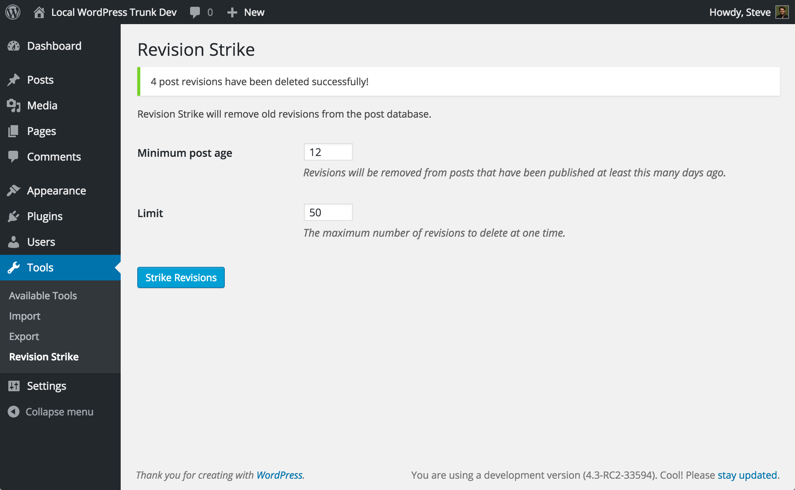

# Revision Strike

[](https://travis-ci.org/stevegrunwell/revision-strike)
[](https://codeclimate.com/github/stevegrunwell/revision-strike)
[](https://codeclimate.com/github/stevegrunwell/revision-strike/coverage)

Unless post revisions are explicitly limited, WordPress will build up a hefty sum of revisions over time. While it's great to have revision history for some recent content, the chances that old revisions will be necessary diminish the longer a post has been published. Revision Strike is designed to automatically remove these unneeded revisions on older, published posts.

**How does it work?**

First, a threshold is set, with a default of 30 days. Once a day, Revision Strike will run and find any post revisions in the database attached to **published** posts with a post date of at least 30 (or your custom threshold) days ago, and "strike" (tear-down and remove) them from the WordPress database.


## Usage

There are a number of ways to interact with Revision Strike:


### WP Cron

Upon plugin activation, a hook is registered to trigger the `revisionstrike_strike_old_revisions` action daily, which kicks off the striking process. This hook is then automatically removed upon plugin deactivation.


### Tools &rsaquo; Revision Strike



You can manually trigger a revision strike by logging into WordPress and visiting the Tools &rsaquo; Revision Strike page.

> **Note:** You must have the "edit_others_posts" capability (typically "Editor"-level and above) in order to see this page.


### WP-CLI

If you make use of [WP-CLI](http://wp-cli.org/) on your site you may trigger Revision Strike with the following commands:

```bash
$ wp revision-strike <command>
```


#### clean

Manually runs an instance of Revision Strike, removing revisions matching the passed arguments or defaulting to the values declared on the Settings &rsaquo; Writing page.

##### Arguments

<dl>
	<dt>--days=&lt;days&gt;</dt>
	<dd>Remove revisions on posts published at least &lt;days&gt; day(s) ago. This is determined by the value set on Settings &rsaquo; Writing or a default of 30.</dd>
	<dt>--limit=&lt;limit&gt;</dt>
	<dd>The maximum number of revisions to remove. This is determined by the value set on Settings &rsaquo; Writing or a default value of 50.</dd>
	<dt>--post_type=&lt;post_type&gt;</dt>
	<dd>One or more post types (comma-separated) for which revisions should be struck. Default value is 'post'.</dd>
	<dt>--verbose</dt>
	<dd>Enable verbose logging of deleted revisions.</dd>
</dl>


#### clean-all

If you have a large number of revisions, it can take Revision Strike some time to work its way through your post history to clean up revisions on a daily basis. The `clean-all` command is like spring cleaning, systematically removing eligible post revisions all at once, giving you a nice, clean revision history to start from, making it easy for the daily cron runner to maintain.

Under the hood, this command just determines how many eligible revisions are in the database, then calls the `clean` command with your arguments and a limit equal to the number of revisions in the database. Thanks to the revision chunking ([#17](https://github.com/stevegrunwell/revision-strike/issues/17)), no more than 50 post revisions are being handled in memory at any given time, ensuring minimal performance impact on your site.

##### Arguments

<dl>
	<dt>--days=&lt;days&gt;</dt>
	<dd>Remove revisions on posts published at least &lt;days&gt; day(s) ago. This is determined by the value set on Settings &rsaquo; Writing or a default of 30.</dd>
	<dt>--post_type=&lt;post_type&gt;</dt>
	<dd>One or more post types (comma-separated) for which revisions should be struck. Default value is 'post'.</dd>
	<dt>--verbose</dt>
	<dd>Enable verbose logging of deleted revisions.</dd>
</dl>


## Filters

Revision Strike leverages the [WordPress Plugin API](https://codex.wordpress.org/Plugin_API) to let you customize its behavior without editing the codebase directly.

### revisionstrike_post_types

Controls the post types for which revisions should be automatically be purged.

<dl>
	<dt>(string) $post_types</dt>
	<dd>A comma-separated list of post types.</dd>
</dl>

#### Example

By default, Revision Strike only works against posts of the "Post" post type. If you'd like to include other post types (pages, custom post types, etc.), this filter will allow you do so.

```php
/**
 * Include the "page" and "book" custom post type in Revision Strike.
 *
 * @param string $post_type A comma-separated list of post types.
 */
function theme_set_post_types( $post_types ) {
	return 'post,page,book';
}
add_filter( 'revisionstrike_post_types', 'theme_set_post_types' );
```


## Releases

### 0.2

* Added a "Limit" setting to Settings &rsaquo; Writing. ([#13](https://github.com/stevegrunwell/revision-strike/issues/13))
* Added a "clean-all" WP-CLI command. ([#14](https://github.com/stevegrunwell/revision-strike/issues/14))
* Clarified language on the Settings &rsaquo; Writing and Tools &rsaquo; Revision Strike pages. Props to @GhostToast for the suggestion! ([#16](https://github.com/stevegrunwell/revision-strike/issues/16))
* Strike requests are now batched into groupings of 50 IDs at a time to avoid overwhelming underpowered machines. ([#17](https://github.com/stevegrunwell/revision-strike/issues/17))

### 0.1

Initial public release.


## Contributing

All development dependencies for the plugin are installed via [Composer](https://getcomposer.org/). After installing Composer on your system, navigate your terminal session to the plugin directory and run:

	$ composer install

Pull requests on this plugin are welcome, but I ask that you please follow these guidelines:

* Every PR that touches code should include a corresponding test. This plugin uses [PHPUnit](https://phpunit.de/), [WP_Mock](https://github.com/10up/wp_mock), [Mockery](http://docs.mockery.io/en/latest/), and [Behat](http://behat.org). Every PR should [generate a passing build in Travis CI](https://travis-ci.org/stevegrunwell/revision-strike) before being considered for merger.
* Please follow the [WordPress Coding Standards](https://codex.wordpress.org/WordPress_Coding_Standards). If you have any doubts, you can run your PHP through [PHP_CodeSniffer](https://www.squizlabs.com/php-codesniffer) using the **RevisionStrike** ruleset:

		$ vendor/bin/phpcs

	This CodeSniffer ruleset combines the "WordPress-Extra" and "WordPress-Docs" rulesets for a *very* specific level of coverage; beyond the coding standards, contributed inline documentation will be checked against the [WordPress Inline Documentation Standards](https://make.wordpress.org/core/handbook/best-practices/inline-documentation-standards/).

### Integration tests

There are a few integration tests for the plugin, written using [Behat](http://behat.org) and scaffolded using [`wp scaffold package-tests`](http://wp-cli.org/commands/scaffold/package-tests/). If you'd like to contribute to these tests, please install the WP CLI Testing framework:

```bash
$ bin/install-package-tests.sh
$ vendor/bin/behat
```

## License

Revision Strike<br>
Copyright &copy; 2015 Steve Grunwell

This program is free software; you can redistribute it and/or
modify it under the terms of the GNU General Public License
as published by the Free Software Foundation; either version 2
of the License, or (at your option) any later version.

This program is distributed in the hope that it will be useful,
but WITHOUT ANY WARRANTY; without even the implied warranty of
MERCHANTABILITY or FITNESS FOR A PARTICULAR PURPOSE.  See the
[GNU General Public License](http://www.gnu.org/licenses/gpl-2.0.html) for more details.

You should have received a copy of the GNU General Public License
along with this program; if not, write to the Free Software
Foundation, Inc., 51 Franklin Street, Fifth Floor, Boston, MA  02110-1301, USA.